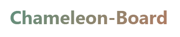
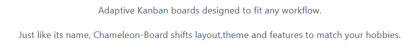
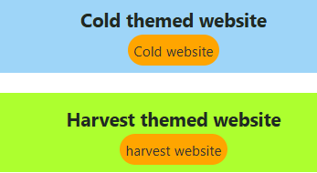
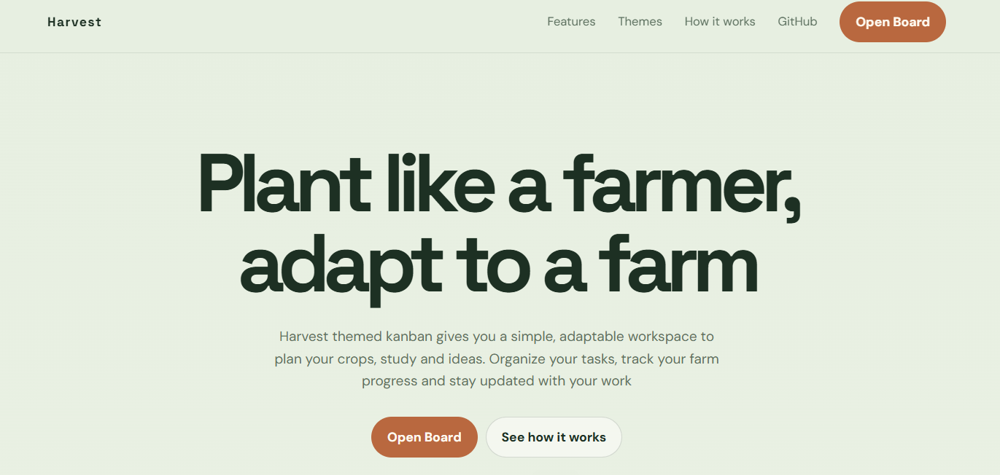
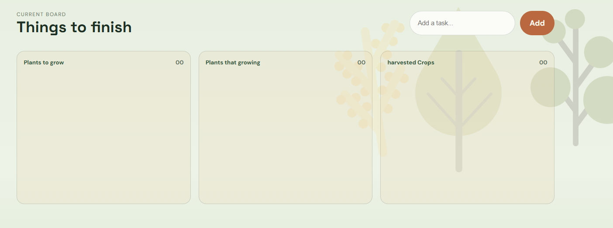

# Welcome To Our Many Themed Kanban Board website

**In this website you can see some themes we made.This time in version 1 there is only 2 themed kanban baord only**

**When you press on that button you go to landing page of a themes like example**

**When you touch that take a look button you will go to kanban board**

**Where you can edit and move to other progresses and delete easily**

# steps to get this in your computer

**You can get in your browser by going to this URL: https://chameleon-board.jazil.workers.dev/**

**Or running locally use this**

**First in terminal or git bash run this:   git clone https://github.com/JazilJafar/chameleon-board.git**

**and use live server in vc code to use this**

**If you like this please give a star❤️💖**

Contribute to this project

# license

MIT License

Copyright (c) 2026 Jazil Jafar V V

Permission is hereby granted, free of charge, to any person obtaining a copy
of this software and associated documentation files (the "Software"), to deal
in the Software without restriction, including without limitation the rights
to use, copy, modify, merge, publish, distribute, sublicense, and/or sell
copies of the Software, and to permit persons to whom the Software is
furnished to do so, subject to the following conditions:

The above copyright notice and this permission notice shall be included in all
copies or substantial portions of the Software.

THE SOFTWARE IS PROVIDED "AS IS", WITHOUT WARRANTY OF ANY KIND, EXPRESS OR
IMPLIED, INCLUDING BUT NOT LIMITED TO THE WARRANTIES OF MERCHANTABILITY,
FITNESS FOR A PARTICULAR PURPOSE AND NONINFRINGEMENT. IN NO EVENT SHALL THE
AUTHORS OR COPYRIGHT HOLDERS BE LIABLE FOR ANY CLAIM, DAMAGES OR OTHER
LIABILITY, WHETHER IN AN ACTION OF CONTRACT, TORT OR OTHERWISE, ARISING FROM,
OUT OF OR IN CONNECTION WITH THE SOFTWARE OR THE USE OR OTHER DEALINGS IN THE
SOFTWARE.