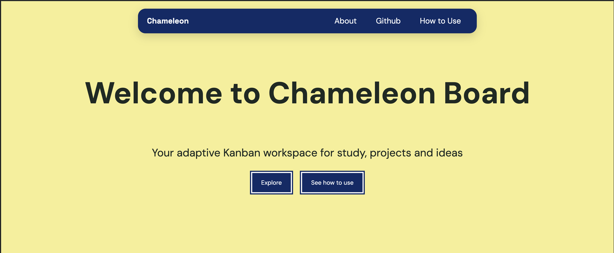
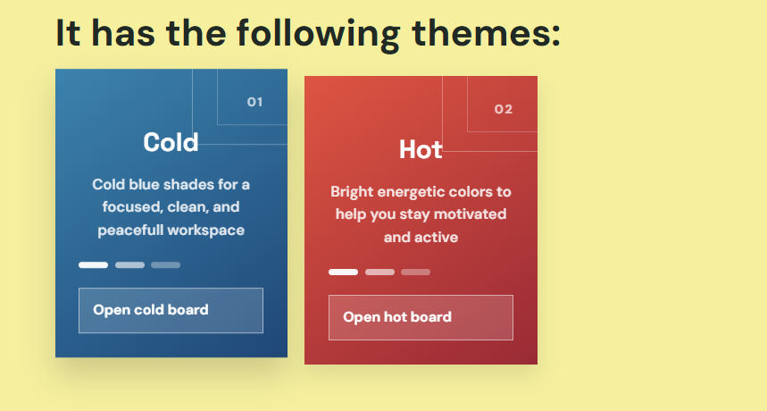
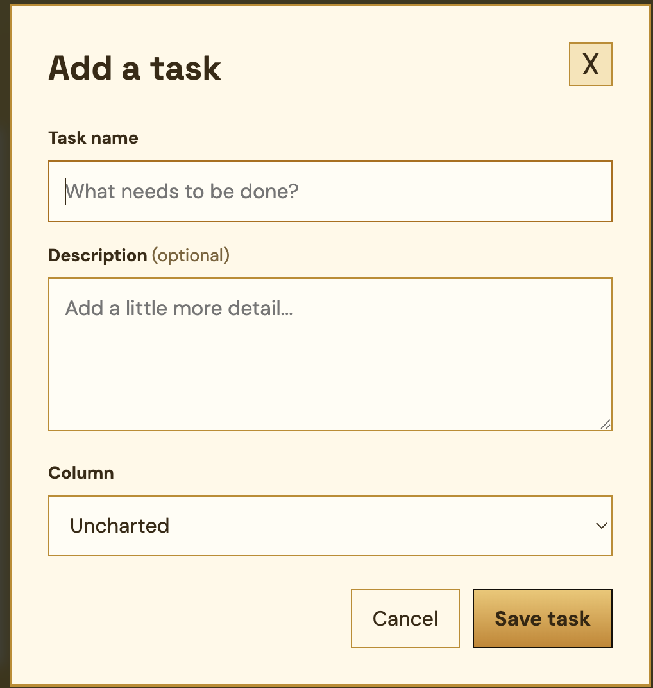
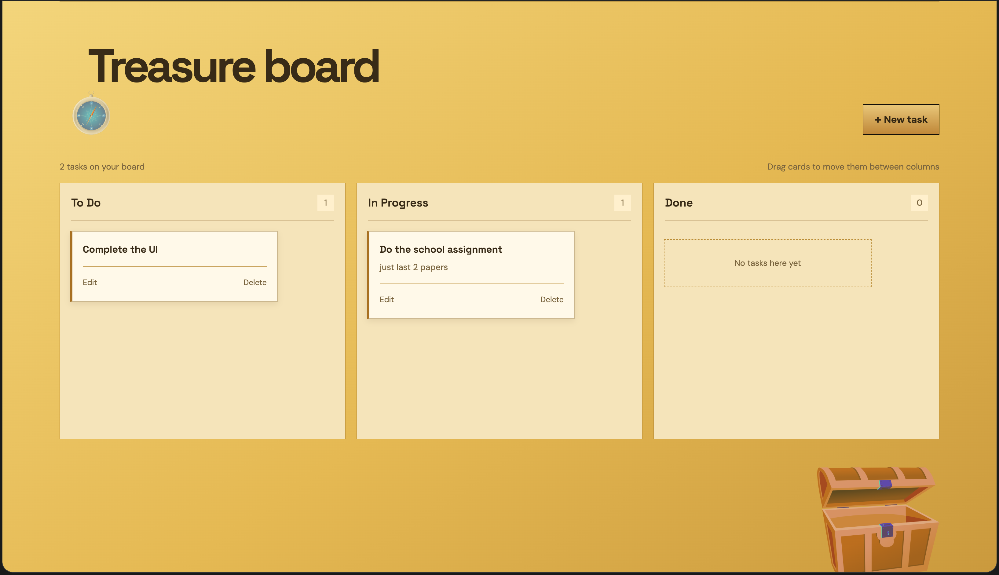

# Chameleon Board

Chameleon board is a multi-theme kanban board. It is available in 4 different themes:
- Cold
- Hot
- Harvest
- Treasure

You can use chameleon board however you want it to be due to it having 4 different themes that match your energy! 

*Well.. that's great*

## Tech Stack
- JavaScript
- CSS
- HTML (obv the basic language)

*and yeah nothing else..*

## How to use it?

Just go to the website [here](https://jaziljafar.github.io/chameleon-board/) and see more about it!

In a simple way though, just go there, choose the theme out of the 4, and start organising your work and get the most productive time!

## Does the work get lost?

Nope, the work doesn't get lost, it uses your localStorage to store your kanban board's data to show it whenever you are back again!

## Images

Here's our landing page

Here are the theme options!

Here is one of our theme on working (Treasure theme)

---

Please star the repo if you liked this! And you're free to contribute!