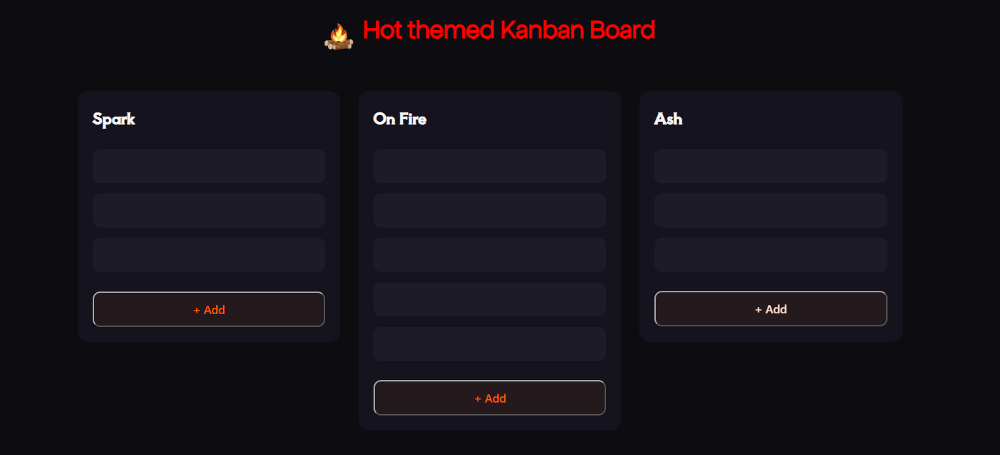

# Chameleon Board

Chameleon board is a multi-theme kanban board. It is available in 4 different themes:
- Cold
- Hot

You can use chameleon board however you want it to be due to it having 4 different themes that match your energy! 

*Well.. that's great*

## Tech Stack
- JavaScript
- CSS
- HTML (obv the basic language)

*and yeah nothing else..*

## How to use it?

Just go to the website [here](https://jaziljafar.github.io/chameleon-board/) and see more about it!

In a simple way though, just go there, choose the theme out of the 2, and start organising your work and get the most productive time!

## Does the work get lost?

Nope, the work doesn't get lost, it uses your localStorage to store your kanban board's data to show it whenever you are back again!

## Images

Here's our landing page

Here are the theme options!

Here is one of our theme on working (Hot theme)

# License

MIT License

Copyright (c) 2026 Jazil Jafar V V

Permission is hereby granted, free of charge, to any person obtaining a copy
of this software and associated documentation files (the "Software"), to deal
in the Software without restriction, including without limitation the rights
to use, copy, modify, merge, publish, distribute, sublicense, and/or sell
copies of the Software, and to permit persons to whom the Software is
furnished to do so, subject to the following conditions:

The above copyright notice and this permission notice shall be included in all
copies or substantial portions of the Software.

THE SOFTWARE IS PROVIDED "AS IS", WITHOUT WARRANTY OF ANY KIND, EXPRESS OR
IMPLIED, INCLUDING BUT NOT LIMITED TO THE WARRANTIES OF MERCHANTABILITY,
FITNESS FOR A PARTICULAR PURPOSE AND NONINFRINGEMENT. IN NO EVENT SHALL THE
AUTHORS OR COPYRIGHT HOLDERS BE LIABLE FOR ANY CLAIM, DAMAGES OR OTHER
LIABILITY, WHETHER IN AN ACTION OF CONTRACT, TORT OR OTHERWISE, ARISING FROM,
OUT OF OR IN CONNECTION WITH THE SOFTWARE OR THE USE OR OTHER DEALINGS IN THE
SOFTWARE.
---

Please star the repo if you liked this! And you're free to contribute!
